### 设计思路
用 flag 包对命令行参数进行解析，用os，bufio.NewReader对文件、os.Stdin进行读取，输出使用os.Stdout.Write()，标准错误输出使用 fmt.Fprintf(os.Stderr, "error_message")。  
1. 命令行参数检查，比较容易，检查参数数量，参数值是否符合要求。
2. 读取部分，通过参数检查判断从键盘读入还是从文件读入，确定rd = bufio.NewReader(os.Stdin) 还是   
rd = bufio.NewReader(file)。通过line, err := rd.ReadString('\n')按行读取文件。  
如果以'\f'作为分页符，则line, err := rd.ReadString('\f')，且加上一句去掉分页符的语句，line = strings.Trim(line, "\f")，将分页符改为换行符，
输出更好看，二者差别不大。其余就是统计页数啊什么的。
3. 管道，使用了 os/exec 包来建立用于进程间通信的管道。给出部分代码。

```
	cmd := exec.Command("cat", "-n")
	stdin, caterr := cmd.StdinPipe()
	if caterr != nil {
		fmt.Fprintln(os.Stderr, "error happened about standard input of command cat")
	}
	...
	stdin.Close()
	cmd.Stdout = os.Stdout
	cmd.Start()
```

### 测试部分
生成了两个测试文件。smalltest从1到13每行一个数字，共13行，每行以'\n'结尾。pagechange从1到10每行一个数字，共10行，每行以'\f'结尾。

Test:  

1.
input:	`go run selpg.go -s 1 -e 1 smalltest`  
output:  
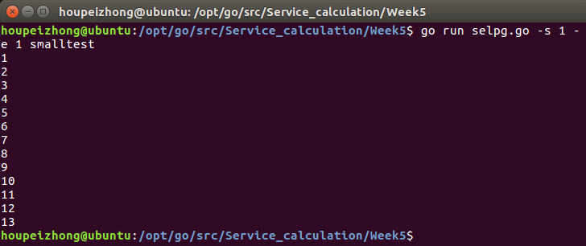

2.
input: `go run selpg.go -s 1 -e 1 < smalltest`  
output:  
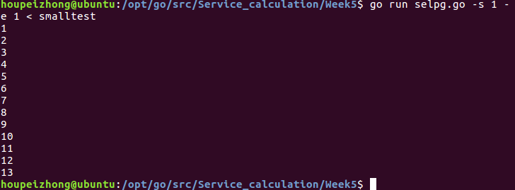  
输出同1

3.
input: `python testoutput.py | go run selpg.go -s 1 -e 1`  
output:  
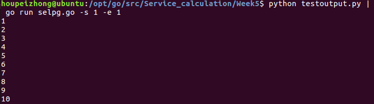  

4.
input: `go run selpg.go -s 1 -e 1 smalltest >outputfile`  
output:  
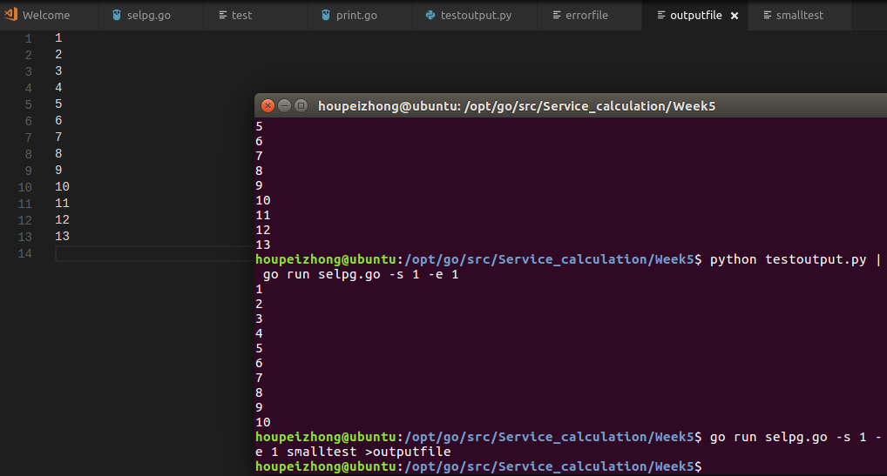  

5.
input: `go run selpg.go -s 1 -e 1 smalltest 2>errorfile`  
output:   
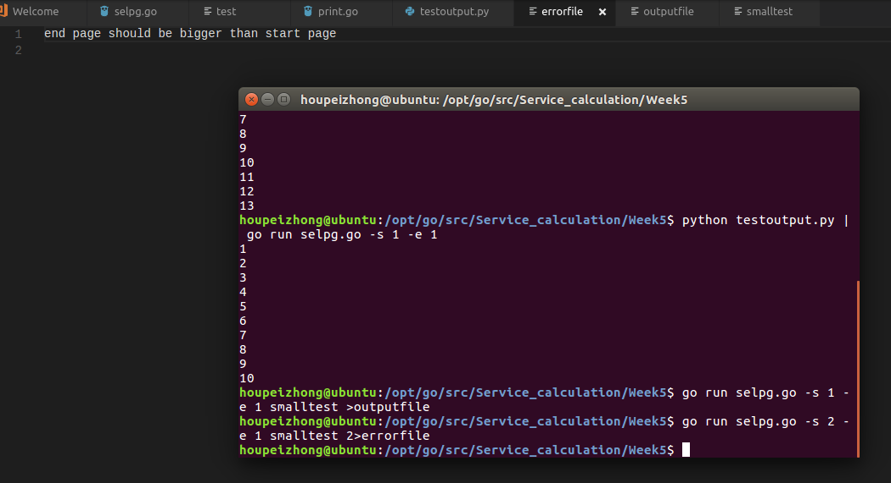  

6.
input: `go run selpg.go -s 1 -e 1 smalltest >outputfile 2>errorfile`  
output:  
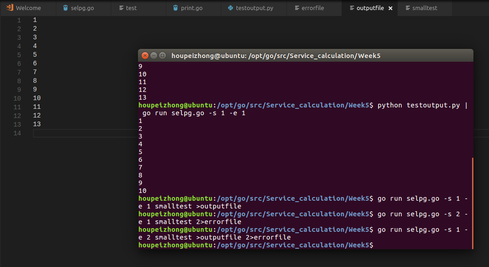  
outputfile保存出错前的输出  
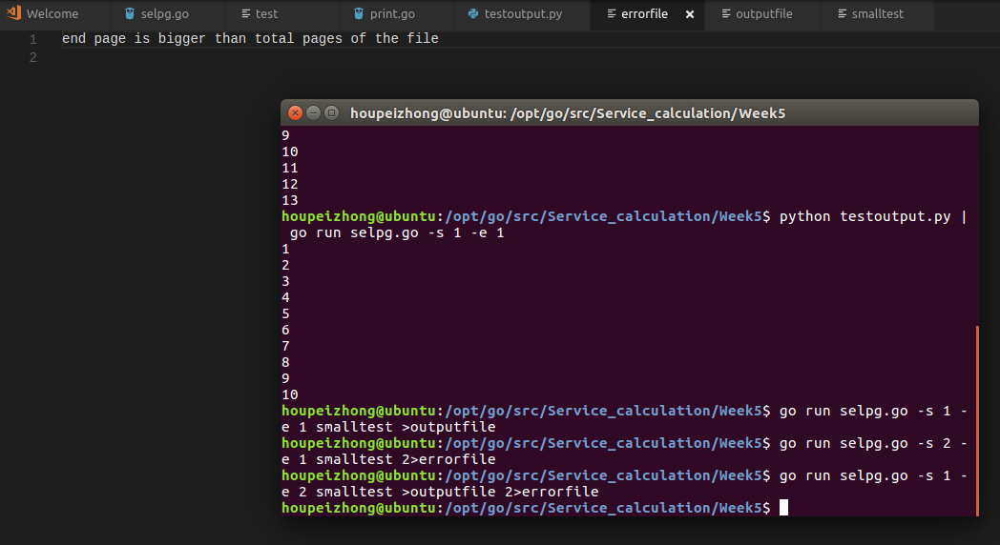  
errorfile保存错误信息  
命令行没有消息打印  

7.
input: `go run selpg.go -s 1 -e 1 smalltest >outputfile 2>/dev/null`   
output: 
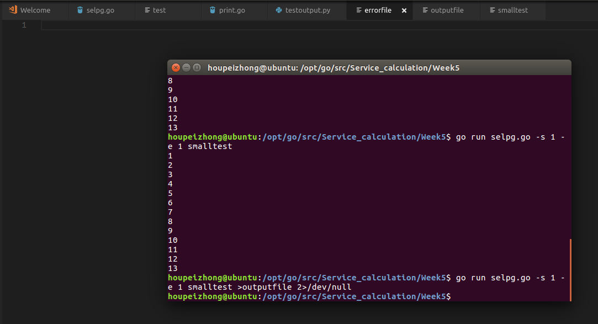  
outputfile文件输出跟6一样。没有错误消息打印到命令行  

8.
input:  
`go run selpg.go -s 1 -e 1 smalltest >/dev/null`  
output:  
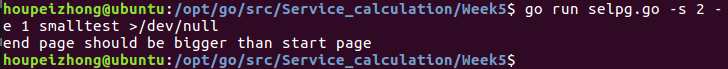  

9.
input:  
`go run selpg.go -s 1 -e 1 smalltest | go run print.go`  
print.go代码为： 
```
package main

import (
	"bufio"
	"fmt"
	"io"
	"os"
)

func main() {
	rd := bufio.NewReader(os.Stdin)
	for {
		line, err := rd.ReadString('\n')
		fmt.Print(line)
		if err != nil || io.EOF == err {
			break
		}
	}
}
```  
output:  
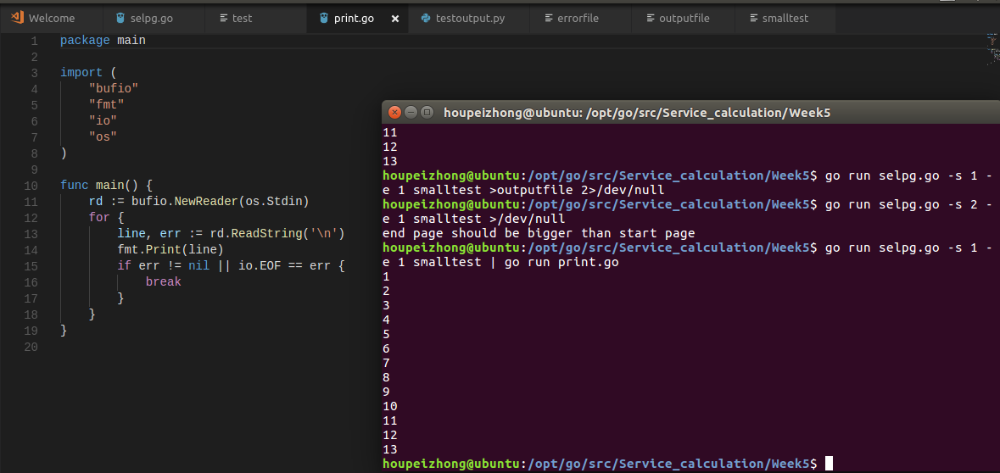  

10.
input:  
`go run selpg.go -s 1 -e 1 smalltest 2>errorfile | go run print.go`  
output:  
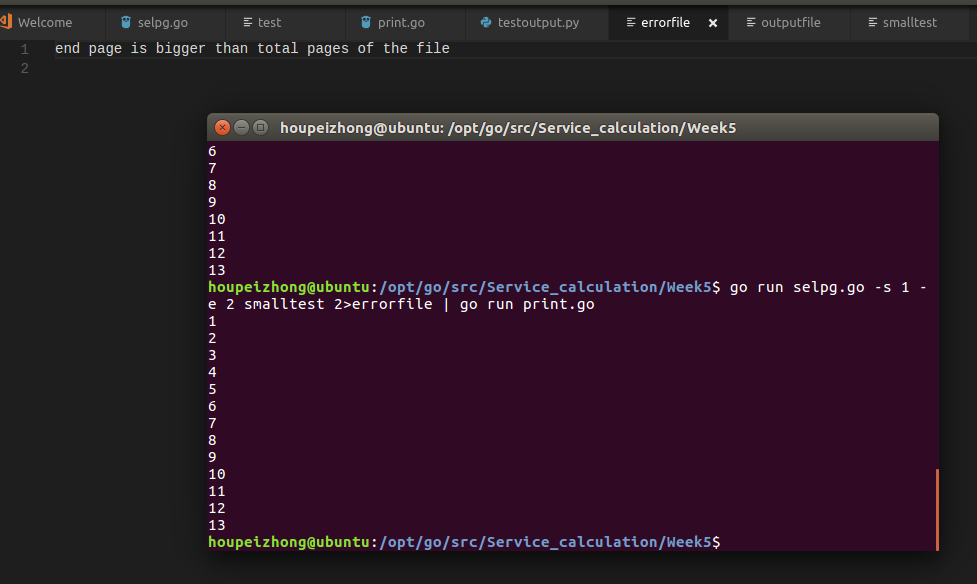  
命令行没有错误输出  
报错信息写到errorfile  
  
11.
input:  
`go run selpg.go -s 1 -e 1 -l 3 smalltest`  
output:  
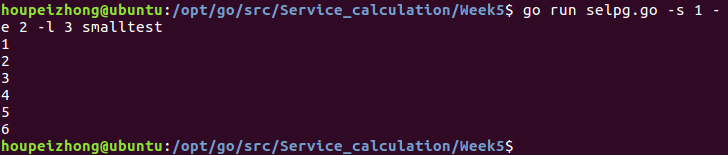  

12.
input:  
`go run selpg.go -s 1 -e 5 -f pagechange`  
output:  
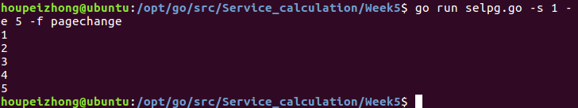  

13.  
input : `go run selpg.go -s 1 -e 1 -d lp1 smalltest`  
output:  
没有打印机，无法测试该命令，将它替换为`cat -n`进行测试  
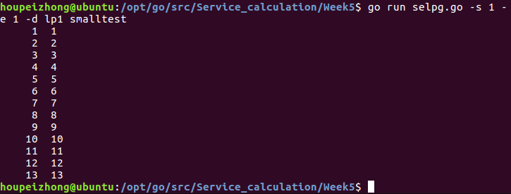  


14.
input: `go run selpg.go -s 1 -e 1 smalltest >outputfile 2>errorfile &`  
output:  
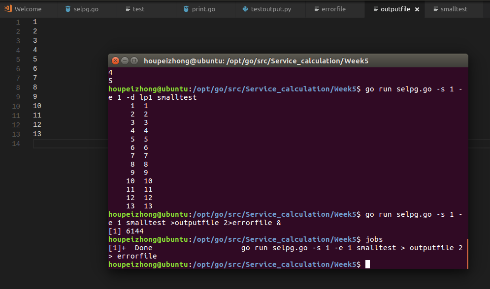  
程序后台运行并且执行完毕  
