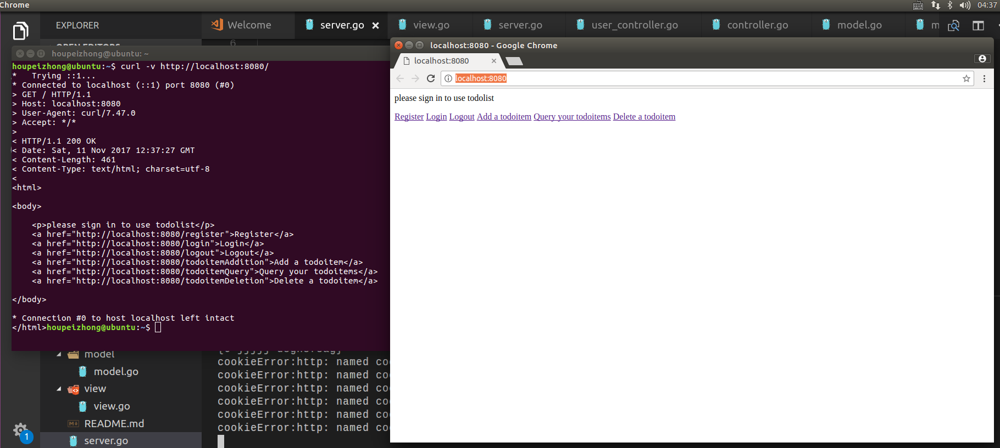
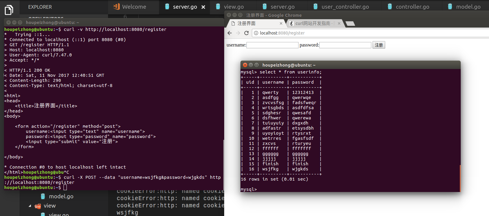
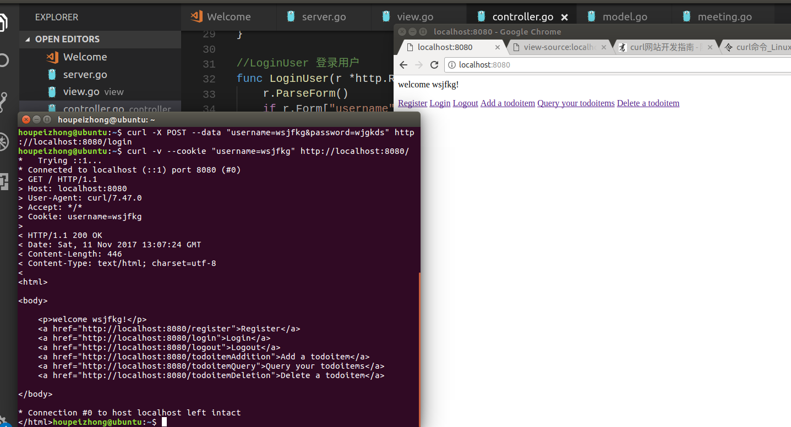
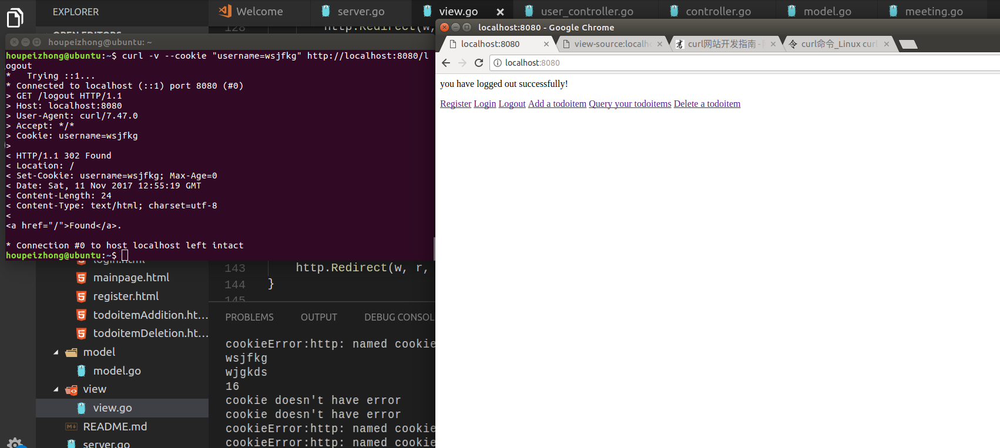
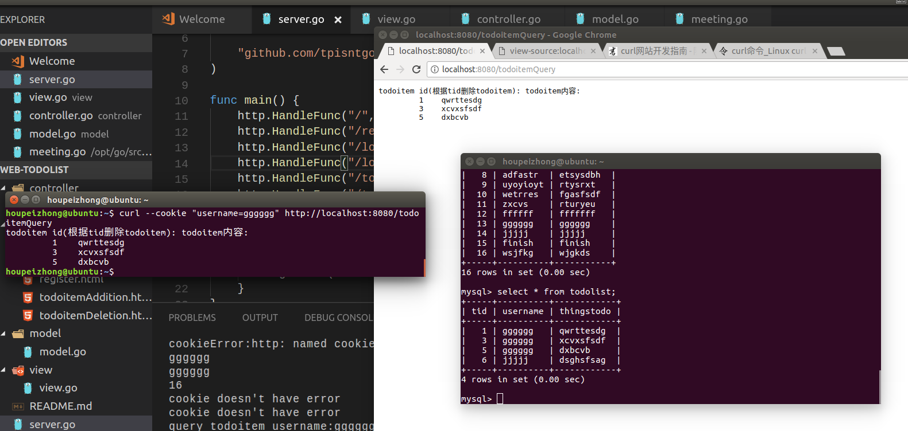
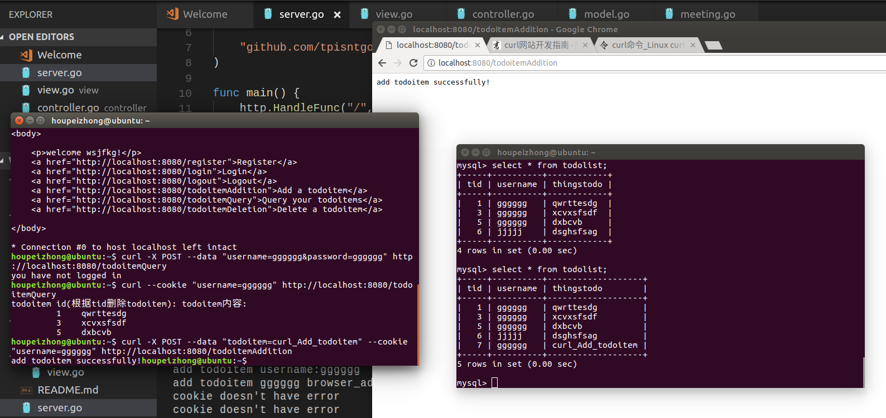
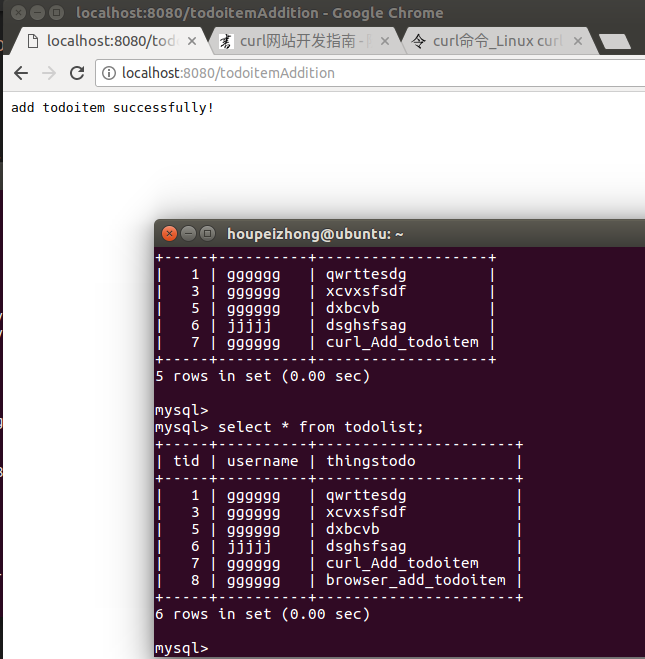
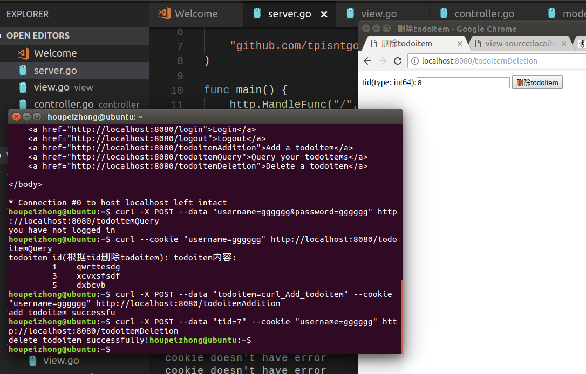
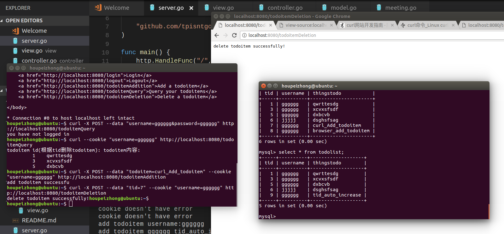

Web-todolist  

使用go自带的包编写，没有使用框架，决策依据是想使用go自带的包来写一次web服务程序，体验下原始的go语言。
感觉用go自带的包写，会更多的去查看源代码，去分析下源码的实现。  

主页面mainpage使用了go自带的html/template包，用于生成对应URL返回的html文件。其他的页面就没用template了。  

稍微看了一下REST原则，概括的说就是：用URL定位资源，用HTTP动词（GET,POST,DELETE,DETC）描述操作。
具体一点的话，有一个方面是：URL不包含动词，因为"资源"表示一种实体，所以应该是名词，动词应该放在HTTP协议中。
我的url尽量改成了名词，希望能够符合REST原则。
RESTful感觉是指架构和RESTful API，使得server的API设计满足RESTful要求。  

使用了mysql数据库保存注册的用户和用户对应的todoitem。
具体就是go自带的"database/sql"包和SQL语句啦。  

使用cookie保存的用户登录状态
我看的资料说目前Go标准包没有为session提供任何支持，看了下资料感觉要加上session需要花不少时间。
如果有时间更新下一版本的话会加上session管理部分  

使用了MVP架构（大概吧，我对架构不是很清楚qwq）  

curl 测试结果（虽然潘老师只说了使用curl测试，为了美观，截图还是包括了浏览器获得的界面）：
主界面：

注册界面，成功注册后会重定向到主界面，最上方会显示 "welcome your_account_username!" （your_account_username是你账户的名字，以下相同），可以看到数据库增加了对应条目：

登录界面，使用了表单，POST方法，登录成功后重定向到主界面，最上方会显示 "welcome your_account_username!"。
命令行第一条语句使用POST方法，发送表单登录，因为主界面通过cookie判断是否登录，第二条语句是curl 使用cookie当做登录，得到的返回界面。

退出登录界面，成功退出后会重定向到主界面，服务器中通过cookie.MaxAge = -1删除对应cookie实现退出登录：

查询todoitem界面，查询一个用户的所有todoitem，通过是否存在cookie判断是否已经登录，需要登录才能使用此功能，可以看到结果和数据库的内容相符合：

增加todoitem界面，通过cookie判断是否登录，使用表单，POST方法，操作完成后数据库增加了对应条目：

删除todoitem界面，通过cookie判断是否登录，使用表单，POST方法，通过数据库todoitem表的主键tid来删除todoitem。tid可以通过查询界面查到，操作完成后数据库删除了对应条目。再次增加todoitem时，主键已经变为9，而数据库tid没有7和8，说明7和8的条目已经被删除。

Apache web 压力测试，测试结果和重要参数解释:  
命令中-n表示请求数，-c表示并发数  
$ ab -n 1000 -c 100 http://localhost:8080/  
//  apache的版本信息  
This is ApacheBench, Version 2.3 <$Revision: 1706008 $>  
Copyright 1996 Adam Twiss, Zeus Technology Ltd, http://www.zeustech.net/  
Licensed to The Apache Software Foundation, http://www.apache.org/  

Benchmarking localhost (be patient)  
Completed 100 requests  
Completed 200 requests  
Completed 300 requests  
Completed 400 requests  
Completed 500 requests  
Completed 600 requests  
Completed 700 requests  
Completed 800 requests  
Completed 900 requests  
Completed 1000 requests  
Finished 1000 requests  

Server Software:          
Server Hostname:        localhost  
Server Port:            8080  

Document Path:          /  
Document Length:        461 bytes  

Concurrency Level:      100            //并发数  
Time taken for tests:   0.250 seconds  //总共使用的时间  
Complete requests:      1000           //完成的请求数  
Failed requests:        0              //失败的请求数  
Total transferred:      578000 bytes   //总共传输字节数，包含http的头信息等  
HTML transferred:       461000 bytes   //html内容总共传输字节数  
Requests per second:    3999.86 [#/sec] (mean)  //重要指标！每秒多少请求，就是服务器的吞吐量  
Time per request:       25.001 [ms] (mean)      //重要指标！用户请求平均等待时间  
Time per request:       0.250 [ms] (mean, across all concurrent requests)  //重要指标！服务器平均处理时间，就是服务器吞吐量的倒数  
Transfer rate:          2257.73 [Kbytes/sec] received  //平均每秒网络上的流量  

Connection Times (ms)  //网络上消耗的时间的分解  

|      item     | min | mean[+/-sd] | median |  max |
| ------------- | --- | ----------- | ------ | ---- |
| Connect:      | 0   | 2   3.3     |  0     | 14   |
| Processing:   | 1   | 23  12.3    | 24     | 65   |
| Waiting:      | 0   | 20  12.6    | 21     | 65   |
| Total:        | 1   | 24  12.9    | 26     | 66   |

Percentage of the requests served within a certain time (ms)  //请求处理时间的分布情况，重要的是90%的请求的处理时间  
  50%     26  //50%的请求在26ms内返回  
  66%     31  //66%的请求在31ms内返回  
  75%     34  
  80%     35  
  90%     41  
  95%     46  
  98%     54  
  99%     57  
 100%     66 (longest request)  
