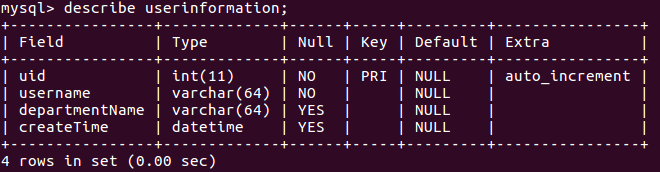

"cloudgo-xorm" 项目，使用 ORM（Object Relational Mapping）库和数据库交互  

创建数据库：  
  
使用Sync2函数和对应的数据库自动同步，如果对应数据库没有此表，则会自动创建该表，表的描述如下：  
  
用 curl POST 用户名和部门名称到网站。数据库有相应的变化：  
  
用 curl POST 用户名到网站，POST时没有提供部门名称。数据库有相应的变化：  
  
程序对于POST的错误处理：  
  
用 curl GET 查询所有用户信息：  
  
用 curl GET 根据userid查询一个用户信息：  
  
程序对于GET的错误处理：  
  

orm 是否就是实现了 dao 的自动化？  
对象-关系映射（Obejct/Relation Mapping,简称ORM）实现了程序应用中的对象到关系数据库中表的自动化持久化，并使用元数据来描述对象和数据库之间的映射关系。本质上，ORM完成的是将数据从一种表现形式转换为另一种表象形式，主要实现程序对象到关系数据库的映射关系。  
个人认为 orm 实现了 dao 的自动化。因为，对于不同的对象，我们想把对象保存进数据库，需要写不同的sql语句，但是如果我们使用orm，只需要调用相同的函数就能够实现保存数据的功能，因此，orm实现了dao的自动化。  

ab压力测试结果，这是使用ORM访问数据库的结果，get方法，查询所有用户信息（一共8条信息），性能不是很好。  
ab -n 1000 -c 100 http://localhost:8080/service/userinfo  
This is ApacheBench, Version 2.3 <$Revision: 1706008 $>  
Copyright 1996 Adam Twiss, Zeus Technology Ltd, http://www.zeustech.net/  
Licensed to The Apache Software Foundation, http://www.apache.org/  

Benchmarking localhost (be patient)  
Completed 100 requests  
Completed 200 requests  
Completed 300 requests  
Completed 400 requests  
Completed 500 requests  
Completed 600 requests  
Completed 700 requests  
Completed 800 requests  
Completed 900 requests  
Completed 1000 requests  
Finished 1000 requests  

Server Software:          
Server Hostname:        localhost  
Server Port:            8080  

Document Path:          /service/userinfo  
Document Length:        915 bytes  

Concurrency Level:      100  
Time taken for tests:   5.427 seconds  
Complete requests:      1000  
Failed requests:        0  
Total transferred:      1039000 bytes  
HTML transferred:       915000 bytes  
Requests per second:    184.27 [#/sec] (mean)  
Time per request:       542.680 [ms] (mean)  
Time per request:       5.427 [ms] (mean, across all concurrent requests)  
Transfer rate:          186.97 [Kbytes/sec] received  

Connection Times (ms)  
              min  mean[+/-sd] median   max  
Connect:        0    0   0.7      0       3  
Processing:     0  455 1360.2      1    5423  
Waiting:        0  454 1360.2      1    5423  
Total:          0  455 1360.8      1    5426  

Percentage of the requests served within a certain time (ms)  
  50%      1  
  66%      1  
  75%      2  
  80%      3  
  90%   1680  
  95%   4592  
  98%   4661  
  99%   5349  
 100%   5426 (longest request)  
 
 作为对比，这是直接使用sql语句的ab压力测试结果，可以看到总共使用的时间，用户请求平均等待时间大幅减少，服务器的吞吐量大幅增加，性能提高很多。  
 ab -n 1000 -c 100 http://localhost:8080/service/userinfo  
This is ApacheBench, Version 2.3 <$Revision: 1706008 $>  
Copyright 1996 Adam Twiss, Zeus Technology Ltd, http://www.zeustech.net/  
Licensed to The Apache Software Foundation, http://www.apache.org/  

Benchmarking localhost (be patient)  
Completed 100 requests  
Completed 200 requests  
Completed 300 requests  
Completed 400 requests  
Completed 500 requests  
Completed 600 requests  
Completed 700 requests  
Completed 800 requests  
Completed 900 requests  
Completed 1000 requests  
Finished 1000 requests  

Server Software:          
Server Hostname:        localhost  
Server Port:            8080  

Document Path:          /service/userinfo  
Document Length:        875 bytes  

Concurrency Level:      100  
Time taken for tests:   0.849 seconds  
Complete requests:      1000  
Failed requests:        0  
Total transferred:      999000 bytes  
HTML transferred:       875000 bytes  
Requests per second:    1177.31 [#/sec] (mean)  
Time per request:       84.939 [ms] (mean)  
Time per request:       0.849 [ms] (mean, across all concurrent requests)  
Transfer rate:          1148.57 [Kbytes/sec] received  

Connection Times (ms)  
              min  mean[+/-sd] median   max  
Connect:        0    3   6.5      1      23  
Processing:     0   80  93.0     54     400  
Waiting:        0   79  92.9     53     398  
Total:          1   84  92.9     59     403  

Percentage of the requests served within a certain time (ms)  
  50%     59  
  66%     73  
  75%     89  
  80%    100  
  90%    127  
  95%    361  
  98%    370  
  99%    400  
 100%    403 (longest request)  
 
cloudgo-io-update 项目，在上次作业cloudgo-io的基础上修改  
上次作业cloudgo-io连接：https://github.com/tpisntgod/Service_Calculation/tree/master/cloudgo-io    
将cloudgo-io的处理数据、操作数据库的model部分改成了java 经典的entity-dao-service结构模型。    
