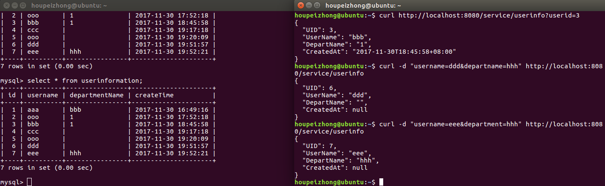

使用 ORM（Object Relational Mapping）库  
  
创建数据库：  
  
创建表：  
  
表的属性的描述：  
  
用 curl POST 用户名和部门名称到网站。数据库有相应的变化：  
  
用 curl POST 用户名到网站，POST时没有提供部门名称。数据库有相应的变化：  
  
程序对于POST的错误处理：  
  
用 curl GET 查询所有用户信息：  
  
用 curl GET 根据userid查询一个用户信息：  
  
程序对于GET的错误处理：  
  
