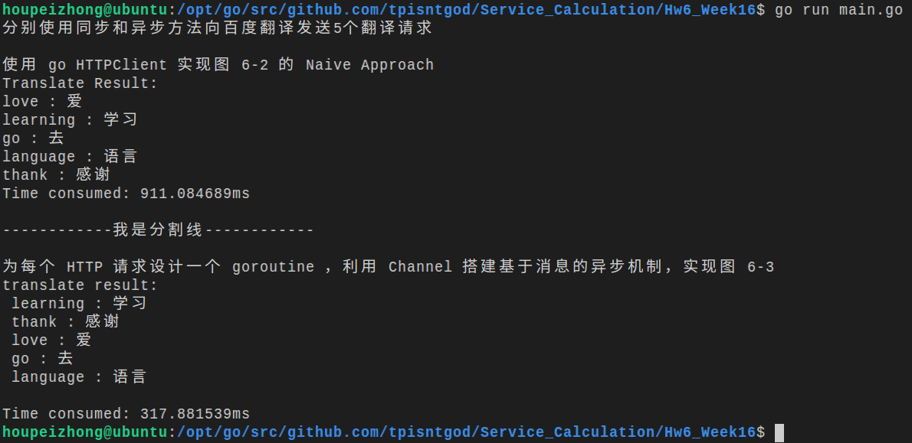

1.依据文档图6-1，用中文描述 Reactive 动机  

Motivation for Reactive Client使用异步处理请求，基于数据流的思想，使用Reactive Approach方便异步代码编写，调试，增强异步代码可读性。使用同步方法同一时间只能发送一个请求，如果多个请求之间相互独立，这样做会浪费时间。使用异步方法，我们可以同时发送多个互不依赖请求，减少花费的时间。而异步方法的代码较为复杂，容易陷入Callback Hell，不利于调试，使用Reactive Approach能够简化代码的编写（感觉类似JavaScript的promise）。为了不暴露内部服务，我们可以实现一个面向外部的，请求处理层(orchestration layer)，该层接受用户的请求，向不同的内部服务发出请求，将各个内部服务的回复合并成单个消息返回给客户端。  

2.使用 go HTTPClient 实现图 6-2 的 Naive Approach  

3.为每个 HTTP 请求设计一个 goroutine ，利用 Channel 搭建基于消息的异步机制，实现图 6-3  

安装方法： go get github.com/tpisntgod/Service_Calculation/Hw6_Week16  

运行结果：  
  

程序实现功能，分别使用同步和异步方法向百度翻译发送5个翻译请求  

4.对比两种实现，用数据说明 go 异步 REST 服务协作的优势  

从上面的截图能够看出，同步方法一个一个发送请求，需要911ms，耗时较多，而异步方法同一时间发送多个请求，需要317ms，耗时较少。go 异步 REST 服务协作，完成服务消耗的时间少，减少响应时间。  

5.思考： 是否存在一般性的解决方案？  
如果处理大量请求，且能够异步处理。 感觉异步+回调是较好方法。  
