cloudgo-io  
在上次作业 Hw3_Week9/Web-todolist 的基础上修改。  

增加功能：  
1.支持静态文件服务  
2.支持简单 js 访问  
3.提交表单，并输出一个表格  
4.对 /unknown 给出开发中的提示，返回码 5xx  

项目结构：  
assets保存静态文件，model，view，controller文件夹对应MVC框架对应的部分  
server文件夹的mainPageHandler.go处理路由/api/mainpage，server.go使用gorilla/mux配置路由，使用urfave/negroni配置和返回一个server。  
templates文件夹存放html模板文件。包含mainpage界面，增加、删除、查询TodoList操作的结果返回界面和查询开发信息的结果返回界面。  
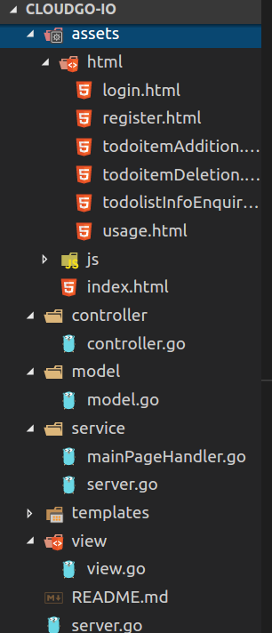  

具体实现：  
1.支持静态文件服务  
将 path 以 “/” 为前缀的 URL 都定位到 webRoot + "/assets/" 为虚拟根目录的文件系统。  
访问用户登录、注册，todoitem增加、删除、查找的网页是，定位到/assets/目录下对应的html。  
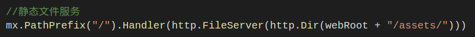  

2.支持简单 js 访问  
先贴一下所有路由对应的Handler的设置，方便以后解释说明，称下图为图H：  
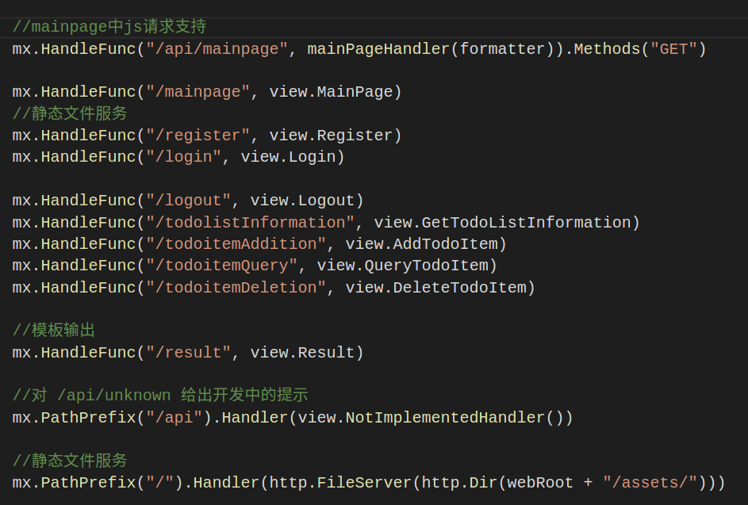  
默认界面index.html有一个链接。  
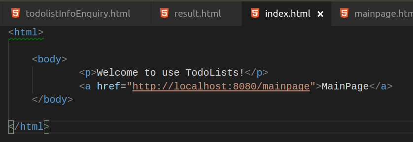  
可从图H中得知，该路由对应的处理函数是view.MainPage   
view.MainPage返回mainpage.html  
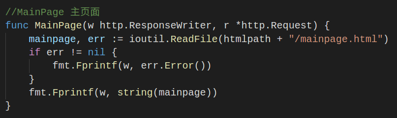
mainpage.html中使用js修改class="username"的&lt;p&gt;标签的信息  
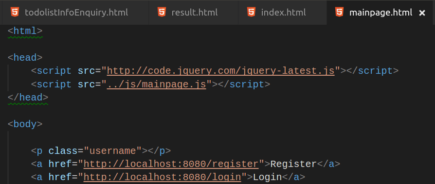
mainpage.js代码，通过ajax异步，GET方法访问/api/mainpage，根据返回的信息修改mainpage中class="username"的&lt;p&gt;标签的信息  
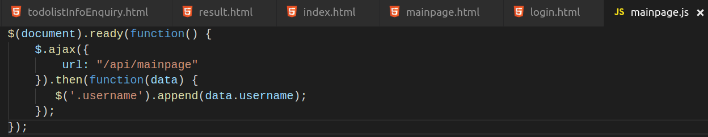
由图H可知，处理路由/api/mainpage的函数是  
mx.HandleFunc("/api/mainpage", mainPageHandler(formatter)).Methods("GET")  
该函数输出了一个匿名结构 ，并使用JSON序列化输出。该json用于mainpage.js文件更改数据。  
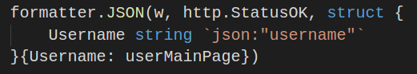

3.提交表单，并输出一个表格  
显示表格的html是使用template写的  
TodoList主界面提供了一个查询TodoList使用方法或者开发人员信息的功能（Check TodoList information按钮对应功能）  
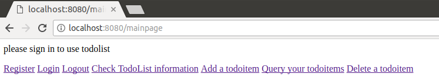  
点击Check TodoList information按钮进入该页面，有一个表单，服务端根据表单填写的信息，输出一个表格，和表格里对应的内容：  
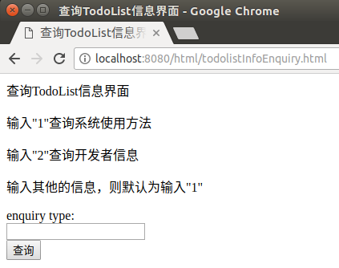  
输出TodoList使用方法的表格：  
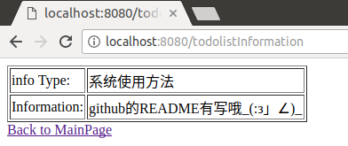  
输出开发者信息的表格：  
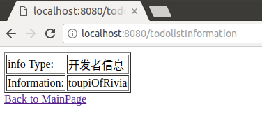  

4.对 /unknown 给出开发中的提示，返回码 5xx  
模仿http包的NotFound函数实现。  
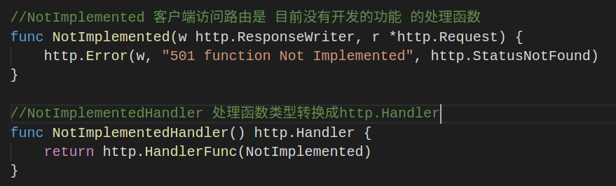  
需要注意的是，mx.PathPrefix("/api").Handler(view.NotImplementedHandler())这个语句放置的位置  
要放在已经实现的路由处理函数之后，这样才不会覆盖掉对应的路由处理函数。  
即mx.HandleFunc("/api/mainpage", mainPageHandler(formatter)).Methods("GET")的位置要在  
mx.PathPrefix("/api").Handler(view.NotImplementedHandler())的位置之前。

项目截图：  
开始界面：  
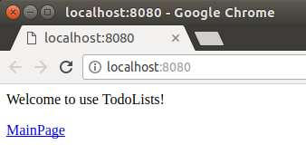  
主界面：  
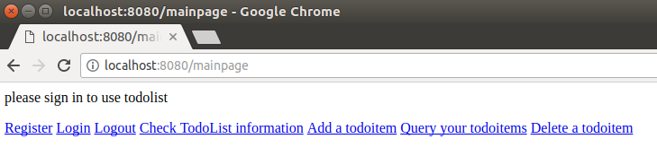  
注册界面：  
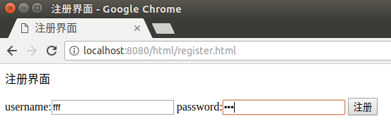  
登录界面：  
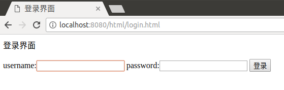  
登陆成功后界面：  
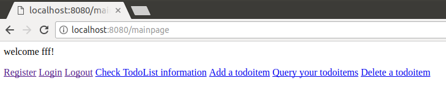  
退出登录界面：  
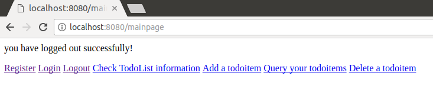  
增加todoitem界面：  
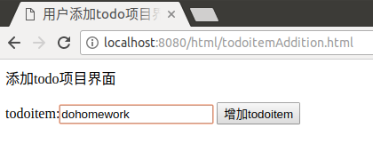  
增加todoitem成功后result界面（删除和查询成功后的result界面类似）：  
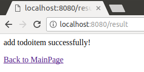  
查询todoitem界面：  
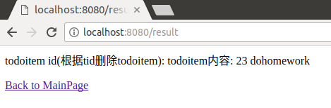  
删除todoitem界面：  
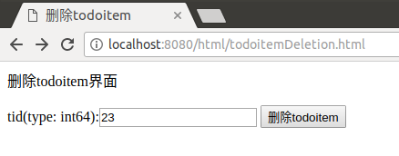  
查询开发信息界面（Check TodoList information按钮进入的界面），第3点已经介绍了，就不重复截图啦。  
